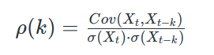
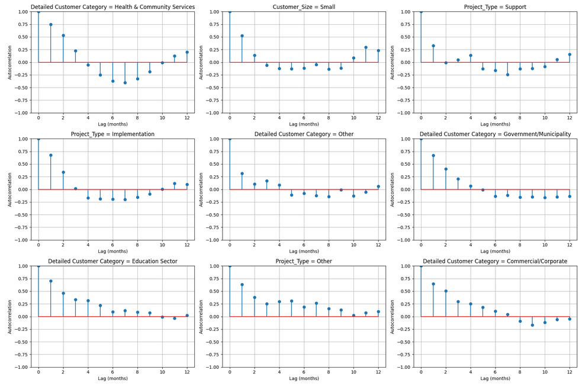
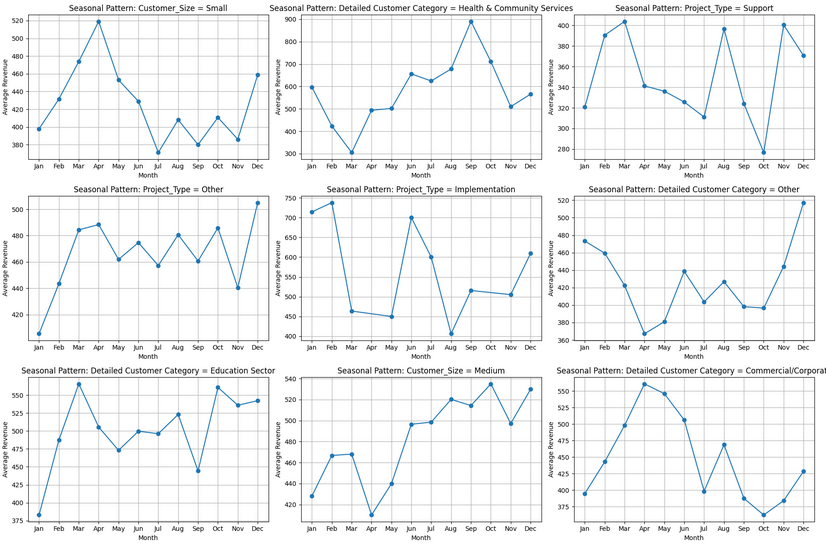
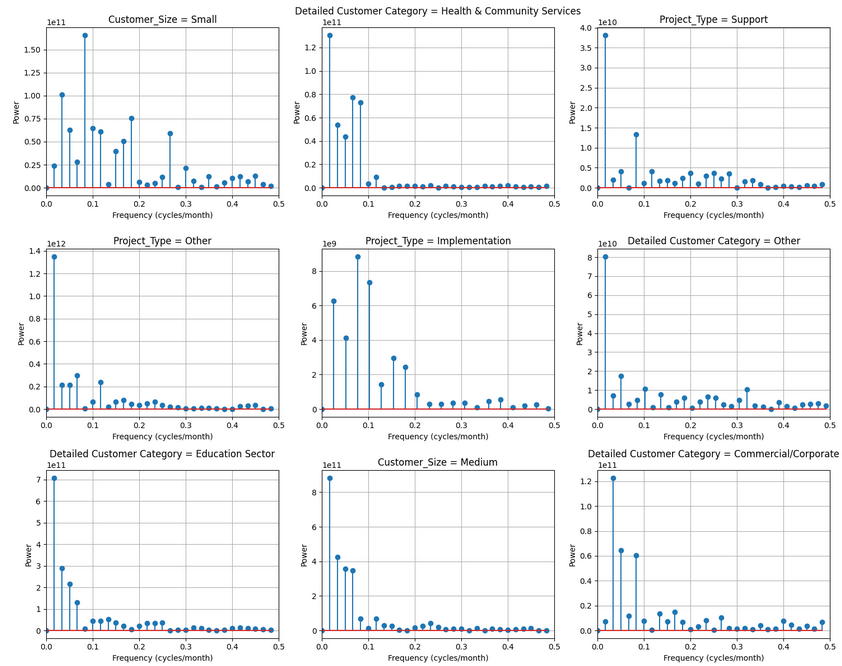

# Tech Company Workload Seasonality
Analysis for a tech company partnered with Northeastern University during the spring quarter of 2025. The data was anonomyzed, and I have provided a sample of the first 100 rows in the data section of this project, but it will not be reproducable. This tech company requested that we analyze their billing data and report any interesting patterns and occurences we can. 

## Motivation / Purpose
The client listed a few things they wanted from us, including predictions, trends and revenue statistics. I chose to focus on the identification of seasonal patterns related to their workload and specific clients or groups of clients.

## Data

One excel file including the columns:
- **Customer Name**: Name of customer where they performed the work
- **Project**: Name of project.
- **Worked Date**: Date of time of entry for the work.
- **Task or Ticket Title**: Title of task or ticket.
- **Resource Name**: Person on their team who delivered the project.
- **Billable Hours**: Number of hours worked for the customer. 
- **Billing Rate**: Rate for consultant on that role on that project
- **Extended Price**: Number of hours multiplied by rate. 

## Methods / Approach

1. **Feature Engineering**: Created customer_category column to sort customers into different sectors. Created multiple columns sorting projects into categories like small/medium/large, days since last project, project category, etc.
2. **Statistical Analysis**:
    - **Detrending** uses a 12-month rolling average to calculate the trend. The detrended revenue is the original revenue minus the trend.
    - **Autocorrelation Function ACF** captures similarity between a time series and a lagged version of itself over successive intervals time intervals. It calculates the correlation between two different versions of the same time series.

- Cov is covariance, σ is standard deviation, Xt represents variable at time t

    - **Seasonality Score** calculates ACF for series and returns correlation at lag 12, lag 6, and lag 4. Symbolizing an annual pattern, semi-annually and quarterly patterns.
    - **Seasonal Decomposition** It splits a time series into three components:
          - Trend – the long-term increase or decrease.
          - Seasonal – the repeating pattern within each period (e.g., months of a year).
          - Residual – what’s left over after removing trend and seasonality (noise or irregular fluctuations).
      The seasonal component is then graphed.
    - **Fourier Transformation** detrends the monthly revenue, converts the time series from the time domain to frequency domain, breaks revenue into waves, and tells you which waves dominate
3. **Visual Analysis**
  - Visual investigation of key sectors and looking at how the seasonality can be represented by graphing.

## Results / Visualizations

### Autocorrelation Function
The graphed categories were picked by subtracting the autocorrelation at the 12 month interval by the value at 6 months. This is a short-hand way of determining the companies with the largest difference in 6 month and 12 month revenue, thereby making them good candidates for high seasonality. I then graphed the 1-12 month autocorrelation for these top categories and visually inspected them.

This graph depicts different sectors and the relationship between the revenue of a given month and past months. If there is a high autocorrelation in say, company_size = Small in the 12 month range, that means that revenue for a any given month is highly correlated to revenue 12 months ago. Likewise, if the 6 month range has a low autocorrelation, that means that revenue for a given month is negatively correlated to revenue 6 months ago. Highly seasonal categories will have these dips in autocorrelation followed by a rise. 

### Seasonal Decomposition
Seasonal decomposistion is a visualization of the seasonal componenent separated from the trend and the residual componenents of revenue. These graphs show the month to month revenue trends in a variety of categories separated out from the overall upward revenue trend.

### Fourier Transformations
Fourier Transformations help visualize the monthly revenue cycles. The x-axis represents cycles per unit time. Full 12 month cycles would be represented by around 0.083 on the x-axis (1/12 = 0.083). The shorter trends, a greater number of cycles per unit time, will be represented by the further off values. The power represents the strength of that frequency component. 

## Insights / Conclusions

I found that looking at seasonality score does not necessarily show the whole picture. However, due to the number of categories and sectors being looked at, it was necessary to narrow down the number of graphs. A number of different existing and created cateogries did exhibit significant seasonality.

- Detailed Customer Category = "Health & Community Services" and "Commerical/Corporate" , Project_Type = "Support" and "Implementation", and Customer_Size = "Small" had the most distinct visually observable seasonality.
- These are sectors and categories of customers, revenue from whom can reliably be categorized as seasonal, and therefore plotted and planned around.
- The client will want to shore up revenue in months where these customers will not be spending. 

## Dependencies / Requirements
pandas

numpy

matplotlib

plotly

dash

statsmodels

scipy

